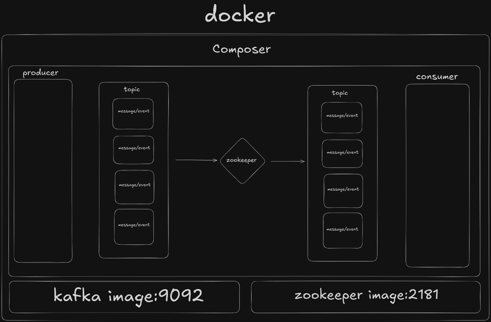
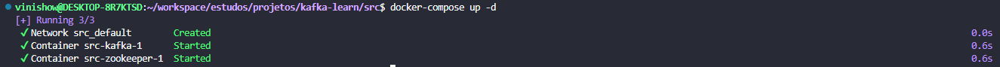
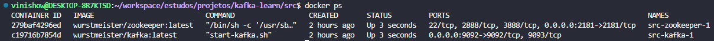
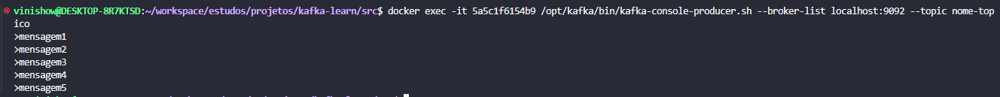
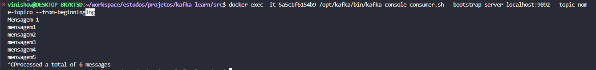

# Kafka

### MBA Engenharia de Dados
### Universidade Presbiteriana Mackenzie
### Matéria: Data Collection & Storage


## Integrantes

|Nome               |
|----               |
|João Pedro         |
|Mônica Dyna        |
|Kayque Mendes      |
|Vinícius Soares    |

---

# Proposta

Desenvolver um projeto de coleta de dados e armazenamento contendo uma fonte de dados(evento, pdf, imagem, vídeo, office) utilizando uma ferramenta de streaming (Kafka ou Event Hub) e armazenamento local ou em nuvem.
Você pode desenvolver Open Source, Microsoft Azure ou AWS.

    1. Arquitetura
    2. Vantagens e benefícios
    3. Manual de utilização


# Solução

### Requisitos

#### 1. WSL [(Docs)](https://learn.microsoft.com/en-us/windows/wsl/)

O Windows Subsystem for Linux (WSL) é uma funcionalidade do Windows que permite executar distribuições Linux diretamente no sistema operacional da Microsoft


#### 2. Docker [(Docs)](https://docs.docker.com/)

Docker é uma plataforma de software open-source que utiliza a tecnologia de contêinerização para empacotar aplicações e suas dependências em unidades isoladas e portáteis, chamadas de contêineres.

#### 3. Kafka [(Docs)](https://kafka.apache.org/20/documentation.html)

O Apache Kafka é uma plataforma de streaming de dados distribuída de código aberto, amplamente utilizada para processamento de stream, pipelines de dados em tempo real e integração de dados em grande escala. 

#### 4. Zookeeper [(Docs)](https://zookeeper.apache.org/doc/r3.9.2/index.html)

ZooKeeper é uma plataforma de coordenação distribuída de código aberto amplamente utilizada em sistemas distribuídos modernos. Ele fornece serviços de coordenação, sincronização e configuração para aplicativos distribuídos, ajudando a garantir a consistência, disponibilidade e tolerância a falhas em ambientes complexos.

----
### Arquitetura




### Vantagens e benefícios

A combinação de Apache Kafka e Zookeeper oferece uma solução robusta e escalável para sistemas de streaming de dados em tempo real. A sinergia entre essas duas tecnologias proporciona uma série de vantagens e benefícios:

#### Zookeeper
    . Coordenação de Serviços
    . Gerenciamento de Estado
    . Notificações de Eventos 

#### Kafka
    . Alta escalabilidade
    . Baixa Latência
    . Persistência dos dados
    . Processamento em Tempo Real
    . Múltiplos Consumidores


### Docker
    . Portabilidade
    . Alta Escalabilidade
    . Eficicência


## Manual de Utilização

### 1. Crie um arquivo Docker Compose


```yml
version: '2'

services:
  zookeeper:
    image: wurstmeister/zookeeper:latest
    ports:
      - "2181:2181"

  kafka:
    image: wurstmeister/kafka:latest
    ports:
      - "9092:9092"
    expose:
      - "9093"
    environment:
      KAFKA_ADVERTISED_LISTENERS: INSIDE://kafka:9093,OUTSIDE://localhost:9092
      KAFKA_LISTENER_SECURITY_PROTOCOL_MAP: INSIDE:PLAINTEXT,OUTSIDE:PLAINTEXT
      KAFKA_LISTENERS: INSIDE://0.0.0.0:9093,OUTSIDE://0.0.0.0:9092
      KAFKA_INTER_BROKER_LISTENER_NAME: INSIDE
      KAFKA_ZOOKEEPER_CONNECT: zookeeper:2181
      KAFKA_CREATE_TOPICS: "my-topic:1:1"
    volumes:
      - /var/run/docker.sock:/var/run/docker.sock
```

 O arquivo define dois serviços: `zookeeper` e `kafka`

 O serviço Kafka é configurado para expor as portas `9092` e `9093`.


### 2. Inicie o Docker Compose

 Abra o terminal no diretório onde o arquivo `docker-compose.yml` se encontra e execute o comando abaixo para iniciar os contêineres Kafka e Zookeeper:

```
docker-compose up -d
```

|Comando                |Descrição                                            |
|-----------------------|---                                                  |
|`docker-compose`       |Comando de interação com o Docker                    |
|`up`                   |Inicia os serviços definidos no `docker-compose.yml` |
|`-d`                   |Inicia os serviços em segundo plano, desacoplado do terminal. Isso significa que o terminal não será bloqueado durante a execução dos serviços |




### 3. Verifique o status do container

 Verifique se o container está executando rodando o comando abaixo:

```
docker ps
```

|Comando                |Descrição                                                |
|-----------------------|---                                                      |
|`docker-ps`            |Lista todos os contêineres Docker que estão em execução. | 



 Você deve ver os contêineres Kafka e Zookeeper na lista

### 4. Crie um `Tópico` Kafka

Utilize o comando abaixo para criação de um tópico

````
docker exec -it <id-conteiner-kafka> /opt/kafka/bin/kafka-topics.sh --create --zookeeper zookeeper:2181 --replication-factor 1 --partitions 1 --topic nome-topico
````

Substitua `<id-conteiner-kafka>` pelo ID atual do container Kafka

(Você pode localizar utilizando `docker ps`)


### 5. Produza e consuma mensagens/eventos

Utilize o console do Kafka para produzir e consumir mensagens e testar a arquitetura

### Produzir

```
docker exec -it <id-conteiner-kafka> /opt/kafka/bin/kafka-console-producer.sh --broker-list localhost:9092 --topic nome-topico
```



### Consumir

```
docker exec -it <id-conteiner-kafka>/opt/kafka/bin/kafka-console-consumer.sh --bootstrap-server localhost:9092 --topic nome-topico --from-beginning
```




### 6. Parar e Remover contêineres

Para parar e remover os contêineres Kafka e Zookeeper, execute o comando abaixo:

```
docker-compose down
```

Isso vai parar e remover os containêineres criados pelo comando `docker-compose up`